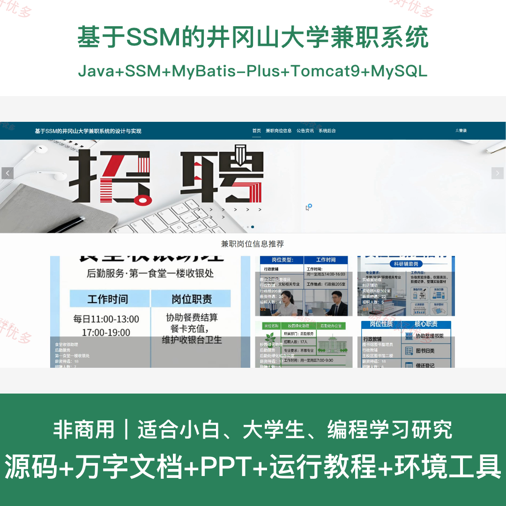
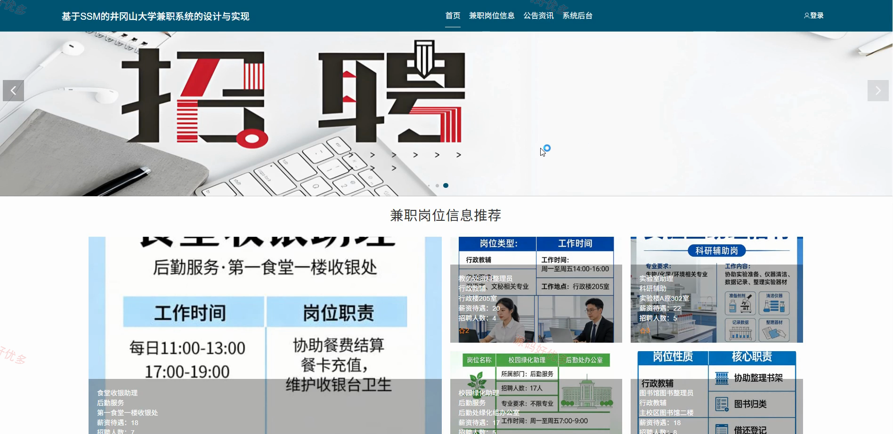
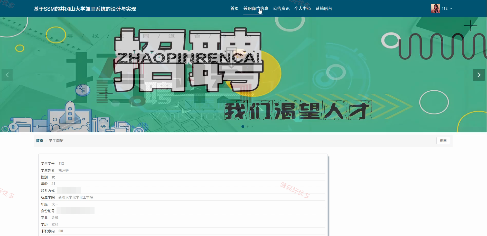
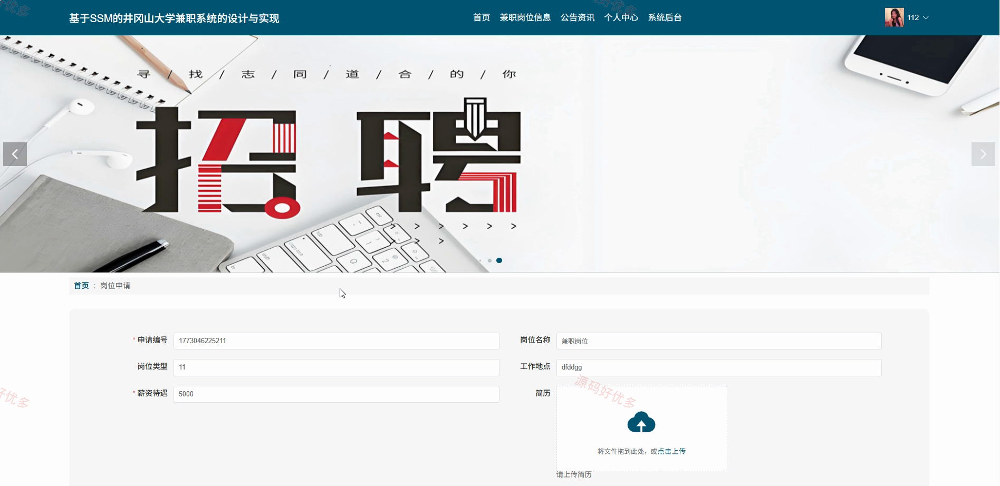
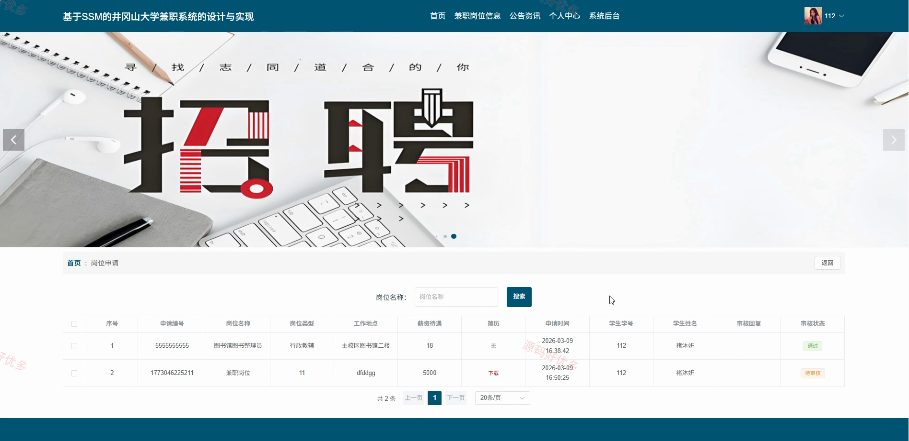
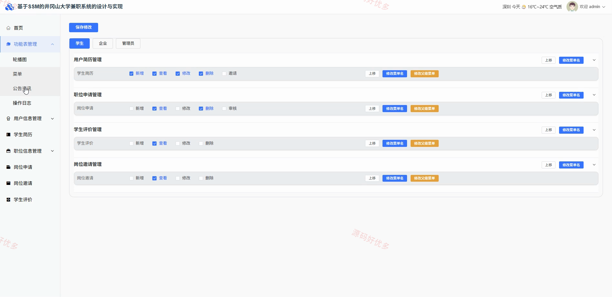
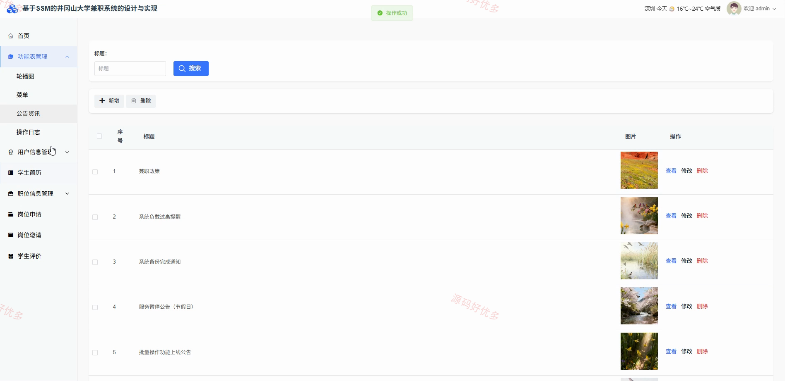
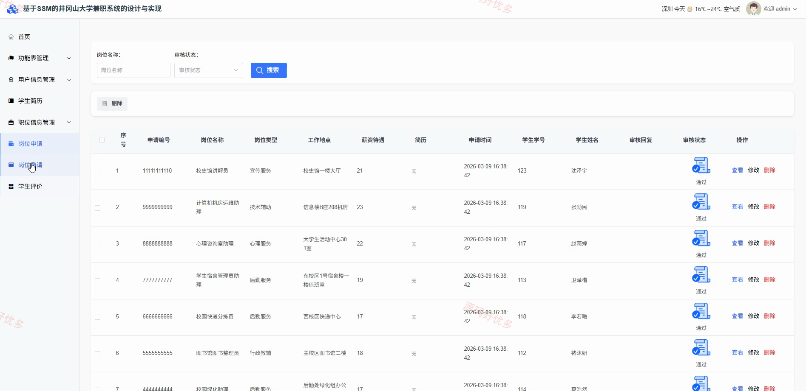
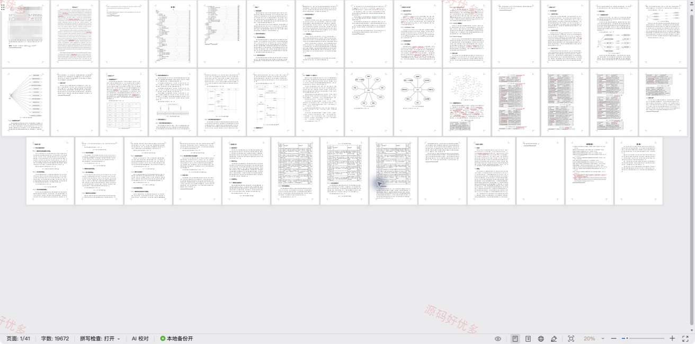

# ssm015D-
ssm015D 基于SSM的井冈山大学兼职系统
## 源码问题查看主页咨询

### 一、关键词
肥胖个性化管控系统、肥胖个性化管控、肥胖个性化管控信息管理、肥胖个性化管控后台管理

### 二、作品包含
源码+数据库+万字设计文档+PPT+全套环境和工具资源+本地部署教程

### 三、项目技术
前端技术： Html、Css、Js、Vue3.5、Element-Plus
后端技术：Java、SpringBoot3.3.0、MyBatis-Plus

### 四、运行环境（以下版本亲测，其他版本兼容性请自行测试）
开发工具：IDEA/eclipse + VSCODE

数据库：MySQL8.0+（共17张表）

数据库管理工具：Navicat10以上版本

环境配置软件： JDK17 + Maven3.6.3

前端Nodejs：16+

浏览器：谷歌浏览器

### 五、项目介绍
项目编号：springbootA687D

基于智能驱动的肥胖个性化管控系统面向管理员、用户，提供项目核心业务等功能，实现各角色在系统中的实际业务协作。

角色：用户、管理员

用户功能：用户注册与前台登录、个性化方案新增与维护、个性化提醒查看与打卡、个性化打卡记录查看、饮食与体重数据采集、健康评估与体重预测、虚拟勋章查看与兑换、新闻资讯与个人中心。

管理员功能：用户信息管理、个性化方案与体脂率分析、个性化提醒与打卡及 AI 数据分析、热量与健康数据采集管理、健康评估与风险分析、虚拟勋章与兑换管理、体重预测与预测数据生成、新闻资讯与弹窗提醒及系统信息管理。

### 六、运行截图

